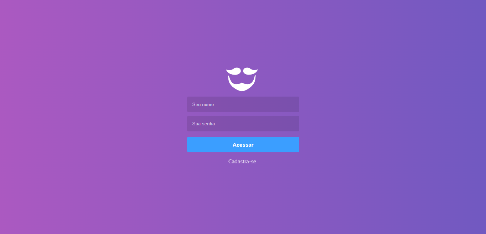
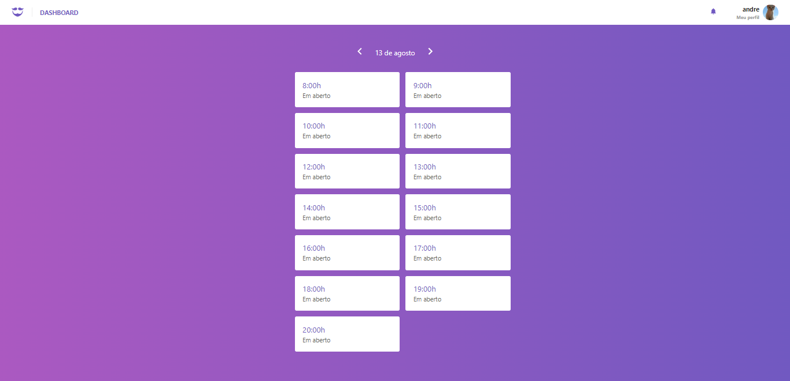
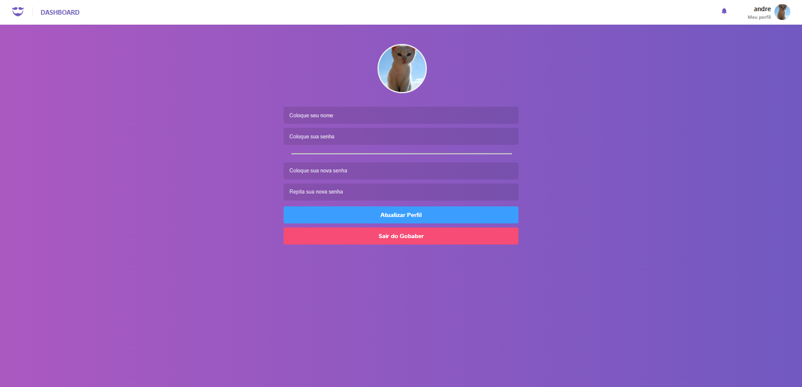

<h1>💈 GOBABER 💈</h1>

Gobaber is a fullstack project for a fictional barbershop, the project consists of the frontend (ReactJs) and backend (NodeJs).

<h1>🎨 Screenshots</h1>

<h1>🚀 Technologies</h1>

This project was developed with the following technologies:

- [Typescript](https://www.typescriptlang.org/)
- [Node.js](https://nodejs.org/en/) | [Express](https://expressjs.com/pt-br/)
- [ReactJs](https://reactjs.org/)
- [PostgreSQL](https://www.postgresql.org/) | [Sequelize](https://sequelize.org/)

<h1>How to run the project</h1>

**⚙️ Access the project's Backend folder:**

    cd Backend

**Then run:**

    yarn dev

**🖥️ Access the project's Frontend folder:**

    cd Frontend

**Then run:**

    yarn start
